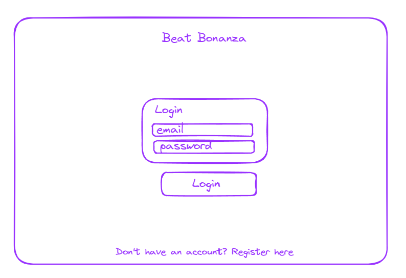
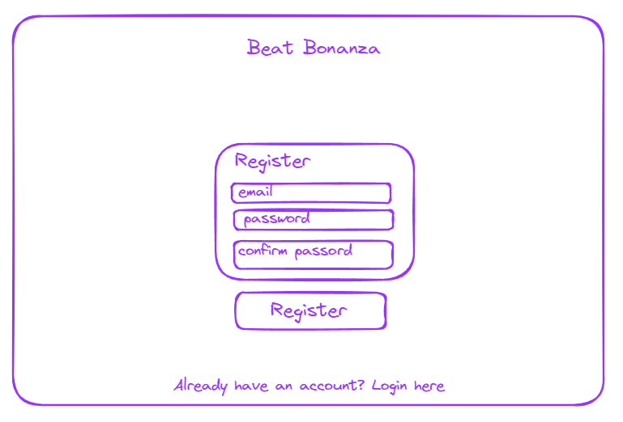
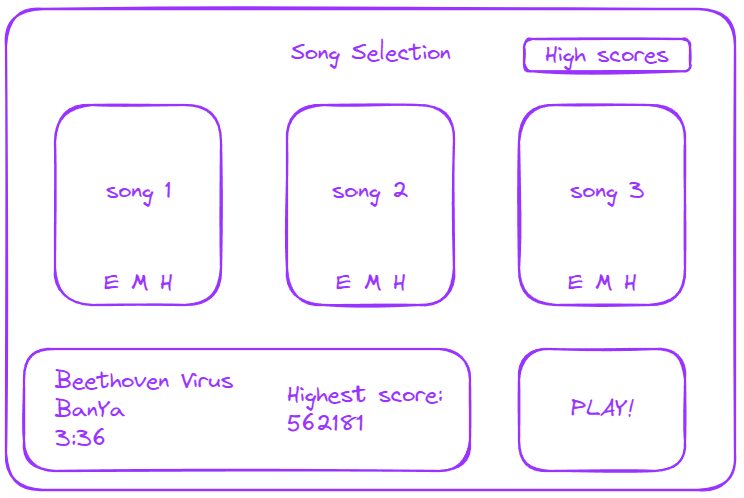
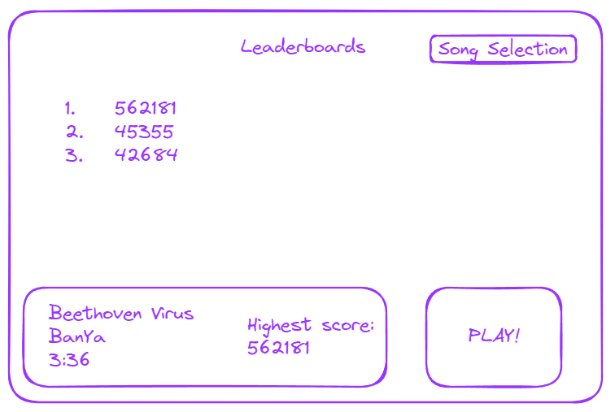
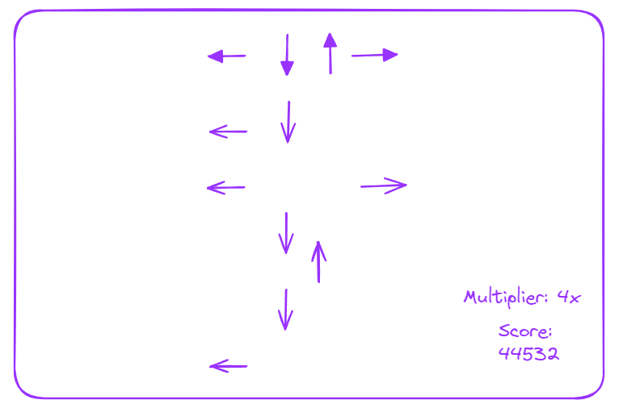
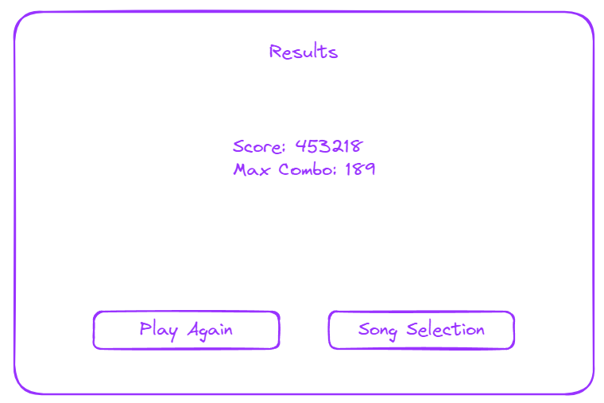

# Beat Bonanza

## Overview

Beat Bonanza is a simple rhythm game where you press the arrows at the correct time to try and get the highest score.

### Problem

Beat Bonanza provides a different way to play. Other rhythm games require specialized controllers while this one only needs a keyboard.

### User Profile

People who enjoy rhythm games:

- looking for something nostalgic to play
- looking to compete with friends
- looking for a game that requires little setup

### Features

- As a user, I want to be able to open up a brower and play a quick rhythm game.
- As a user, I want to be able to see my high scores and compare them to my other people.
- As a user, I want to see how well I performed on a song when it is finished.
  
## Implementation

### Tech Stack

- React
- MySQL
- Express
- Server libraries: 
    - express
- Client libraries
    - react
    - axios

  

### APIs

List any external sources of data that will be used in your app.

  - Web Audio API

### Sitemap

  

List the pages of your app with brief descriptions. You can show this visually, or write it out.

- Login
- Register
- Song selection
- Game
- Results
- Leaderboards
  

### Mockups

#### Login


#### Register


#### Song Selection


#### Leaderboards


#### Game


#### Results

  

### Data

- Users and scores will be stored in a JSON file.
  

### Endpoints

  

List endpoints that your server will implement, including HTTP methods, parameters, and example responses.

**GET /user**
- Get user to display username

Response: 
```
[
  {
    "id": 1,
    "username": "coolguyezekiel"
  }
]
```

**GET /scores**
- Used to get the 3 highest scores of the user

Response: 
```
[
  {
    "id": 1,
    "highscore1": "564234",
    "highscore2": "529153",
    "highscore3": "494267",
  }
]
```

**POST /user/register**
- Used to register a user

Response: 
```
[
  {
    "id": 1,
    "username": "coolguyezekiel"
  }
]
```


**POST /user/login**
- used to login a user

Response: 
```
[
  {
    "token": "JWT token..."
  }
]
```


### Auth


- Auth will be implemented using JWT

  

## Roadmap


- Create gameplay
  - Main gameplay of the game 

- Create server
  - express with routes and JSON containing data

- Create login/register pages

- Create leaderboards page
  - Will show highest scores of the user
  

## Nice-to-haves

- Add dancepad functionality
  - User can plug in a dancepad and play with that instead of using the keyboard

- Add songs and create new beat maps
  - The user can use their own songs and create their own beat maps
  - User must be able to complete the song before they can publish
